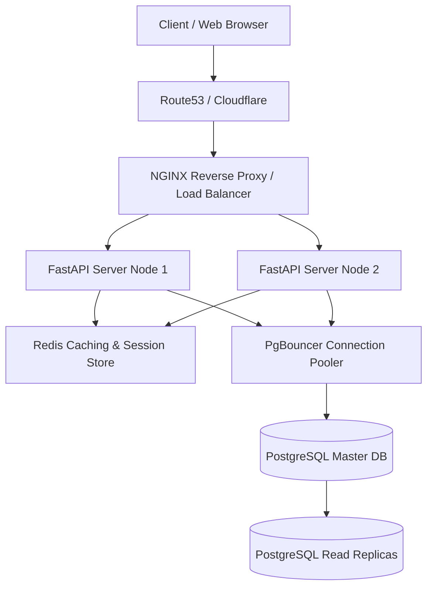

# TaskOrchestrator: Secure, Scalable REST API & Frontend

A professional, role-based Task Orchestration system built as part of the Backend Developer (Intern) Assignment. It features a robust Python **FastAPI** backend, database schemas managed by **SQLAlchemy ORM** over **SQLite**, custom error validation interceptors, and a premium, responsive **Vanilla JS Single Page Application (SPA)** dashboard.

---

## 🌟 Core Features Implemented

- **JWT Authentication & Hashing**: Secure user registration, password hashing (using `bcrypt` via `passlib`), and stateful-less authorization using standard JWTs (`pyjwt`).
- **Role-Based Access Control (RBAC)**: Distinct permissions for `user` and `admin` roles, strictly validated at the API route layer via dependency injection.
- **RESTful CRUD Operations**: Full task lifecycle management with pagination, status-based filtering, and ownership isolation.
- **Unified Validation Error Handling**: Intercepts Pydantic and FastAPI validation errors to return unified JSON messages.
- **Postman Documentation**: Pre-compiled collection file containing variables, request scripts, and test setups (`api_documentation.json`).
- **Interactive UI Dashboard**: Gorgeous glassmorphic SPA utilizing Tailwind CSS CDN, micro-animations, and toast feedback.

---

## 📁 Repository Directory Structure

```text
scalble api/
│
├── backend/
│   ├── app/
│   │   ├── __init__.py
│   │   ├── config.py         # Configs (JWT secret, DB URL, Admin defaults)
│   │   ├── database.py       # SQLAlchemy engine and session pooler
│   │   ├── models.py         # SQLAlchemy schemas (Users, Tasks)
│   │   ├── main.py           # FastAPI entrypoint & validation handlers
│   │   │
│   │   ├── schemas/          # Pydantic Input/Output schemas
│   │   │   ├── auth.py
│   │   │   └── task.py
│   │   │
│   │   ├── routers/          # Modular API routers (v1 versioning)
│   │   │   ├── auth.py       # Reg/Login & User Profile
│   │   │   ├── tasks.py      # Task CRUD
│   │   │   └── admin.py      # Admin stats & user rosters
│   │   │
│   │   └── utils/            # General helpers
│   │       ├── security.py   # JWT & Password Hashing
│   │       └── deps.py       # Dependency providers (JWT verification & RBAC)
│   │
│   └── static/               # Frontend SPA assets (served at root /)
│       ├── index.html        # Glassmorphic responsive layouts
│       ├── style.css         # Background glows and transition styling
│       └── app.js            # Frontend router, state management & REST client
│
├── api_documentation.json    # Complete Postman Collection export
├── requirements.txt          # PIP dependencies manifest
└── README.md                 # Project guide
```

---

## ⚙️ Quick Start Installation & Execution

### 1. Prerequisites
- **Python 3.10+** (Python 3.14 recommended)
- **Git**

### 2. Setup Virtual Environment
Run the following commands inside the repository root:
```powershell
# Create virtual environment
python -m venv .venv

# Activate virtual environment (Windows Powershell)
.venv\Scripts\Activate.ps1

# Install required dependencies
pip install -r requirements.txt
```

### 3. Launch the Server
Execute the server using Uvicorn:
```powershell
python -m uvicorn backend.app.main:app --reload
```
*The server will start at: `http://127.0.0.1:8000`*

### 4. Open the Web Application
- **Frontend SPA**: Navigate to `http://127.0.0.1:8000/` in your browser.
- **Interactive Swagger Docs**: Navigate to `http://127.0.0.1:8000/api/v1/docs`.
- **Alternative ReDoc**: Navigate to `http://127.0.0.1:8000/api/v1/redoc`.

> [!IMPORTANT]
> **Default Seed Credentials**:
> The application database is seeded automatically with a default administrator account on first boot:
> - **Email**: `admin@example.com`
> - **Password**: `admin123`
>
> You can register standard users directly from the UI and toggle their roles by logging into the admin dashboard!

---

## 📖 API Endpoint Directory

All endpoints are versioned under `/api/v1/`.

| Endpoint | Method | Auth Scheme | Description |
| :--- | :---: | :---: | :--- |
| `/auth/register` | `POST` | Public | Register user (`email`, `password`, `full_name`, `role`). |
| `/auth/login` | `POST` | Public | JSON login. Returns JWT token, user credentials. |
| `/auth/login/swagger`| `POST` | Public | Form login. Compatible with Swagger UI. |
| `/auth/me` | `GET` | Bearer Token | Returns logged in user profile details. |
| `/tasks/` | `POST` | Bearer Token | Create new task (`title`, `description`, `status`). |
| `/tasks/` | `GET` | Bearer Token | Retrieve user tasks (paginated. Admin can fetch all via `all_users=true`). |
| `/tasks/{id}` | `GET` | Bearer Token | Retrieve individual task details (limited to owner or admins). |
| `/tasks/{id}` | `PUT` | Bearer Token | Modify task fields (limited to owner or admins). |
| `/tasks/{id}` | `DELETE`| Bearer Token | Remove task (limited to owner or admins). |
| `/admin/stats` | `GET` | Admin Token | Get global server stats: user metrics & status totals. |
| `/admin/users` | `GET` | Admin Token | Get list of all registered users. |
| `/admin/users/{id}/role` | `PUT` | Admin Token | Update a user's role (query parameter `role=admin` or `user`). |

---

## 📈 Scalability & Production Readiness Note

To transition this single-server monolith into a high-throughput, enterprise-ready system supporting millions of requests, the following architectural steps should be implemented:



### 1. Database Scaling (Transition from SQLite to PostgreSQL)
- **SQLite Limitation**: SQLite is file-based and runs lock protocols during database writes, limiting horizontal scaling.
- **Production Migration**: Migrate to a cluster of **PostgreSQL** databases.
- **Read/Write Segregation**: Direct write operations to a Master Database node and redirect `GET` search queries to read-replicas, utilizing a proxy manager like **PgBouncer** to pool client database connections.
- **Database Indexing**: Create B-Tree indexes on `owner_id` on the `tasks` table and `email` on the `users` table to maintain O(1) searches.

### 2. Caching layer (Redis integration)
- **Session & Token Caching**: Store revoked JWT blacklists or frequently accessed user profile details in **Redis** cache (RAM-based) with appropriate TTLs.
- **Entity Caching**: Cache user tasks list queries (e.g. `/api/v1/tasks/`). When a user creates/updates/deletes a task, invalidate the cache key `user_tasks:{user_id}`. This reduces database hits by up to 90%.

### 3. Horizontal Scaling & Load Balancing
- **Stateless Monolith**: The FastAPI app is naturally stateless, since session verification occurs via cryptographic JWT validation rather than server memory sessions.
- **Load Balancers**: Deploy multiple FastAPI server processes inside **Docker containers**, run behind an **NGINX** or **AWS ALB** reverse proxy configured with round-robin load balancing.
- **Process Manager**: Use **Gunicorn** wrapping **Uvicorn workers** (`gunicorn -w 4 -k uvicorn.workers.UvicornWorker main:app`) to scale across multicore servers.

### 4. Containerization & Orchestration
- Package application files into lightweight Docker images.
- Use **Docker Compose** for simple multi-container local testing (FastAPI + Redis + PostgreSQL).
- Deploy onto **Kubernetes (EKS/GKE)** with Horizontal Pod Autoscalers (HPA) targeting CPU/Memory thresholds to dynamically scale pods in response to surge traffic.
